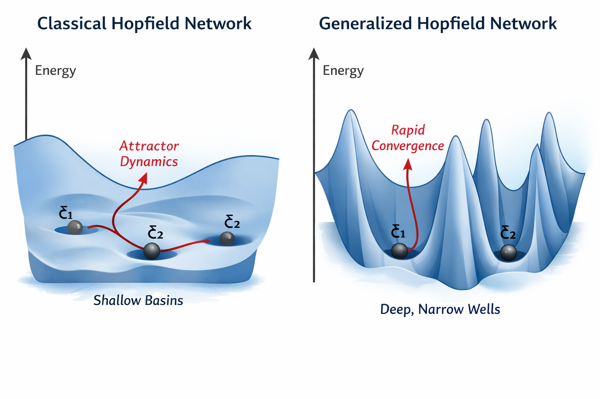

<!-- Written by Dr. Francesco Fedele for CEE4803 Art & generative AI - (c) Georgia Tech, Spring 2026 -->

# Modern Hopfield Networks  
A Log-Sum-Exp Generalization of the Classical Hopfield Model

## Introduction

The classical Hopfield network uses a quadratic energy based on pairwise interactions and stores only ~0.14N patterns.  
The modern Hopfield network (Ramsauer et al., 2020) replaces the quadratic term $\sum_\mu (\mathbf{s}\cdot\boldsymbol{\xi}^\mu)^2$  
with a *log-sum-exp* (LSE) term, yielding exponential storage capacity and a direct equivalence to self-attention.  
In the following we derive both models, highlight the role of the quadratic regularizer, define the state-dependent matrix $J(\mathbf{s})$,  
and show the transformer connection.

## 1. Classical Hopfield Network

The energy of the classical Hopfield network is

$$
E(\mathbf{s}) = -\frac{1}{2} \mathbf{s}^\top W \mathbf{s}
$$

with binary states $\mathbf{s} \in \{-1,+1\}^N$ and the Hebbian weight matrix

$$
W = \frac{1}{N}\sum_{\mu=1}^P \boldsymbol{\xi}^\mu (\boldsymbol{\xi}^\mu)^\top \qquad (\text{patterns } \boldsymbol{\xi}^\mu \in \{-1,+1\}^N).
$$

Substituting the Hebbian rule into the energy gives a revealing form:

$$
\begin{aligned}
E(\mathbf{s}) 
&= -\frac{1}{2N} \mathbf{s}^\top \Bigl( \sum_{\mu=1}^P \boldsymbol{\xi}^\mu (\boldsymbol{\xi}^\mu)^\top \Bigr) \mathbf{s} \\
&= -\frac{1}{2N} \sum_{\mu=1}^P (\mathbf{s} \cdot \boldsymbol{\xi}^\mu)^2.
\end{aligned}
$$

This shows that the classical energy is *minus the sum of squared dot products* with all stored patterns.  
The network tries to maximize the (squared) similarity to the memories. Because the interactions are purely quadratic (pairwise),  
the capacity is severely limited ($\approx 0.14N$ random patterns before catastrophic crosstalk).

Dynamics are usually synchronous sign updates:

$$
s_i \leftarrow \mathrm{sign}\Bigl( \sum_j W_{ij} s_j \Bigr).
$$

## 2. Modern Hopfield Network — Log-Sum-Exp Generalization

The modern formulation keeps the insight that the network should maximize similarity to stored patterns,  
but replaces the *sum of squares* above with a much sharper *log-sum-exp* function.

The modern energy is

$$
E(\mathbf{s}) = \frac{1}{2} \|\mathbf{s}\|^2 - \frac{1}{\beta} \log \sum_{\mu=1}^P \exp\bigl(\beta \boldsymbol{\xi}^\mu \cdot \mathbf{s}\bigr),
$$

or equivalently, with memory matrix $X = [\boldsymbol{\xi}^1 \dots \boldsymbol{\xi}^P] \in \mathbb{R}^{N\times P}$:

$$
E(\mathbf{s}) = \frac{1}{2} \|\mathbf{s}\|^2 + \mathrm{LSE}(\beta X^\top \mathbf{s}),
$$

where $\mathrm{LSE}(\mathbf{z}) = \log\sum_i e^{z_i}$.

### Why replace $\sum (\mathbf{s}\cdot\boldsymbol{\xi}^\mu)^2$ with LSE?

- The quadratic form $\sum (\mathbf{s}\cdot\boldsymbol{\xi}^\mu)^2$ creates relatively **shallow** and overlapping basins.
- The exponential inside the log-sum-exp creates **extremely sharp** peaks: when $\beta$ is large, the energy is dominated by the single best-matching pattern.
- Result: the attraction basins become almost disjoint even when $P \gg N$, giving **exponential storage capacity**.

> **Figure caption**  
> Energy landscapes of classical Hopfield (left: shallow basins) and modern generalized Hopfield (right: deep, narrow wells).  
> The classical model features broad, shallow attractors leading to slow and sometimes ambiguous convergence,  
> while the modern model creates sharp, deep wells that enable rapid and reliable convergence even with many stored patterns.

### Why do we need the quadratic regularizer $\frac12 \|\mathbf{s}\|^2$?

Without the $\frac12 \|\mathbf{s}\|^2$ term the energy would be unbounded from below: the system could make $\|\mathbf{s}\|$ arbitrarily large  
in the direction of any memory to drive $E\to -\infty$.  

The quadratic term acts as a *soft L2 penalty* (a spring pulling $\mathbf{s}$ toward the origin).  
It creates a balance between:

- the attraction toward stored patterns (LSE term), and
- the cost of large state norms.

This balance guarantees stable fixed points with finite norm and makes the dynamics equivalent to scaled self-attention.

## 3. Derivation of the Update Rule

Gradient descent on the modern energy yields

$$
\frac{d\mathbf{s}}{dt} = -\nabla E(\mathbf{s}) = -\mathbf{s} + X \cdot \mathrm{softmax}(\beta X^\top \mathbf{s}).
$$

In discrete form (most common in practice) we obtain the fixed-point iteration:

$$
\mathbf{s}^{(t+1)} = X \cdot \mathrm{softmax}(\beta X^\top \mathbf{s}^{(t)}).
$$

## 4. State-Dependent Weight Matrix $J(\mathbf{s})$

Define the attention weights

$$
\mathbf{p}(\mathbf{s}) = \mathrm{softmax}(\beta X^\top \mathbf{s}).
$$

The state-dependent weight matrix is

$$
J(\mathbf{s}) := X \mathrm{diag}(\mathbf{p}(\mathbf{s})) X^\top = \sum_{\mu=1}^P p_\mu(\mathbf{s}) \, \boldsymbol{\xi}^\mu (\boldsymbol{\xi}^\mu)^\top.
$$

$J(\mathbf{s})$ is the direct generalization of the classical Hebbian matrix: instead of equal weights $1/P$ for every pattern,  
each pattern $\boldsymbol{\xi}^\mu$ is weighted by how well the *current state* $\mathbf{s}$ matches it.  
Hence the matrix is **state-dependent**.

## 5. Modern Hopfield = Scaled Self-Attention

Let the current state $\mathbf{s}$ act as query, and the stored patterns $X$ act as both keys and values.  
The scaled dot-product attention formula is

$$
\mathrm{Attention}(\mathbf{q},K,V) = \mathrm{softmax}\Bigl(\frac{\mathbf{q} K^\top}{\sqrt{d_k}}\Bigr) V.
$$

Setting $\mathbf{q} = \mathbf{s}$, $K = X^\top$, $V = X$, and scaling factor $\sqrt{d_k} = 1/\beta$ gives exactly

$$
\mathbf{s}_\text{new} = X \cdot \mathrm{softmax}(\beta X^\top \mathbf{s}),
$$

which is identical to the modern Hopfield update.  
Thus a single modern Hopfield layer **is** one self-attention head (with patterns stored as key/value memory).

## 6. Conclusion

By replacing the quadratic similarity term $\sum (\mathbf{s}\cdot\boldsymbol{\xi}^\mu)^2$ with a log-sum-exp  
and adding the norm regularizer $\frac12\|\mathbf{s}\|^2$,  
the modern Hopfield network achieves exponential capacity and becomes mathematically equivalent to transformer self-attention.
