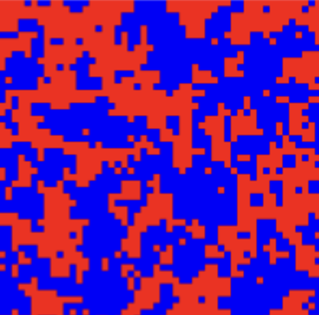

<!-- Written by Alex Jenkins and Dr. Francesco Fedele for CEE4803/LMC4813 - (c) Georgia Tech, Spring 2025 -->

# Ising Model

## Introduction
The Ising Model is a mathematical model used in statistical physics to describe magnetism in materials. It represents a system of spins (small magnetic moments) arranged on a lattice, where each spin can be in one of two states: +1 (up) or -1 (down). The spins interact with their neighbors, and the total energy of the system depends on how many spins are aligned versus misaligned.

The system evolves according to the principles of energy minimization—it tends to settle into a state that lowers its overall energy. At high temperatures, the spins fluctuate randomly (disordered phase), but as the temperature decreases, they begin to align, forming magnetic domains. At a critical temperature (phase transition), the system shifts from a disordered to an ordered state, modeling how real magnets gain or lose magnetization.

Imagine a group of friends deciding whether to wear red shirts (+1) or blue shirts (-1). Each friend prefers to match the color of their closest friends, but some are influenced by external trends (like a celebrity wearing blue). If it's a hot day (high temperature), everyone is chaotic, choosing colors randomly. But as it gets colder (low temperature), friends start coordinating, and soon, everyone might be wearing the same color.

### Relation to Neural Networks
The Ising model has deep connections to artificial neural networks,particularly the Hopfield network and the Boltzmann Machine, both of which draw inspiration from statistical physics to model complex systems.  

In a Hopfield network, neurons correspond to spins in the Ising model, and the synaptic weights between them resemble the interaction terms ($J_{ij} s_i s_j$) in the Ising Hamiltonian $H = \sum_{i,j} J_{ij} s_i s_j$. The network operates by minimizing an energy function akin to the Ising model’s Hamiltonian, defined as:

$$ E = -\sum_{i,j} W_{ij} s_i s_j - \sum_i b_i s_i, $$

where $W_{ij}$ are the weights, $s_i$ are the neuron states, and $b_i$ are biases. This energy minimization process enables the Hopfield network to function as an associative memory, storing patterns as low-energy states and retrieving them when presented with partial or noisy inputs, making it valuable for pattern recognition tasks.

The Boltzmann Machine extends this concept further by introducing a probabilistic framework rooted in the Boltzmann distribution, directly linking it to the statistical mechanics of the Ising model. Introduced by Hinton and Sejnowski (1982), the Boltzmann Machine consists of binary units—visible units for observed data and hidden units for latent features—connected symmetrically with weights $W_{ij}$.  
Its energy function is:

$$ E(\mathbf{v}, \mathbf{h}) = -\sum_{i,j} W_{ij} v_i h_j - \sum_i b_i v_i - \sum_j c_j h_j, $$

where $v_i$ and $h_j$ are the states of visible and hidden units, respectively, and $b_i$ and $c_j$ are biases.  
The probability of a configuration is given by:

$$ P(\mathbf{v}, \mathbf{h}) = \frac{e^{-E(\mathbf{v}, \mathbf{h}) / T}}{Z}. $$

## Mathematical Formulation

The Ising model is a fundamental mathematical framework in statistical mechanics used to describe phase transitions and collective behavior in physical systems. It consists of a collection of magnetic spins, each of which can take one of two possible values:

$$ s_i = +1 \quad \text{(spin up)} \quad \text{or} \quad s_i = -1 \quad \text{(spin down)}. $$

These spins are arranged in a lattice, and each spin interacts with its nearest neighbors.

### Energy or Hamiltonian of the Ising Model

The total energy, or Hamiltonian, of the Ising model is given by:

$$ H = -J \sum_{\langle i,j \rangle} s_i s_j, $$

where:
- $J$ is the interaction strength between neighboring spins,
- $s_i$ and $s_j$ are the spin values at lattice sites $i$ and $j$,
- The summation runs over all nearest-neighbor pairs $\langle i,j \rangle$ in the lattice.

For ferromagnetic materials, where $J > 0$, the system favors aligned spins. This means that configurations in which neighboring spins are parallel ($s_i s_j = 1$) lead to lower energy states. Conversely, configurations where neighboring spins are antiparallel ($s_i s_j = -1$) increase the system's energy.

### Boltzmann Distribution and Statistical Mechanics

In statistical mechanics, the probability of a system being in a given configuration $s$ at thermal equilibrium is given by the Boltzmann distribution:

$$ P(s) = \frac{e^{-\beta E(s)}}{Z}, $$

where:
- $E(s)$ is the energy of the configuration $s$,
- $\beta = \frac{1}{k_B T}$ is the inverse temperature,
- $T$ is the absolute temperature,
- $k_B$ is the Boltzmann constant, and $k_B T$ is dimensionless,
- $Z$ is the partition function given by:

$$ Z = \sum_s e^{-\beta E(s)}. $$

This probability distribution explains how likely different spin configurations are at a given temperature.

#### Low-Temperature Limit ($\beta \to \infty$)
At low temperatures ($T \to 0$ or $\beta \to \infty$), the system tends to occupy states, or configurations with minimal energy $E_\text{min}$:

$$ 
P(s) \approx \begin{cases} 
1, & E(s) = E_\text{min} \\ 
0, & \text{otherwise} 
\end{cases} 
$$

This means that only the ground state (or degenerate ground states) is significantly occupied.

#### High-Temperature Limit ($\beta \to 0$)
At high temperatures ($T \to \infty$ or $\beta \to 0$), thermal energy $k_B T$ becomes large compared to the energy differences between states, allowing the system to explore a wider range of configurations. The probability of being in a state with energy \( E \) becomes nearly uniform, as the Boltzmann factor $e^{-E / k_B T}$ approaches $1$ for all energies $E$:

$$ P(E) = \frac{1}{Z} \approx \frac{1}{N} \quad \text{as} \quad T \to \infty~(\beta \to 0) $$

where $N$ is the total number of accessible states. At high temperatures, the system is nearly equally likely to occupy any of the available configurations due to the large thermal fluctuations.

As the temperature increases, the system transitions from being dominated by low-energy states at low temperatures to a more uniform distribution of states at high temperatures. This transition is continuous and smooth, and the system may experience a phase transition at a critical temperature $T_c$, beyond which thermal fluctuations cause a qualitative change in behavior, such as from an ordered state to a disordered one.

### Metropolis Algorithm for Finding Minimal Energy Configurations

The Metropolis algorithm is a numerical method used to simulate equilibrium properties of the Ising model. It works as follows: Choose a temperature $k_B T$ and its inverse $\beta = 1/(k_B T)$.

1. Select a random spin in the system.
2. Compute the energy change $\Delta E$ if the spin is flipped.
3. If $\Delta E \leq 0$, accept the flip, as it lowers the energy.
4. If $\Delta E > 0$, accept the flip to allow thermal fluctuations. The probability of accepting the unfavorable flip is given by:

$$ P = e^{-\beta \Delta E}. $$

$P$ is an exponentially decreasing function of $\Delta E$, meaning that larger energy increases lead to smaller acceptance probabilities. Generate a random number $r$ uniformly from $[0,1]$. If $r<e^{-\beta \Delta E}$ accept the flip, otherwise reject flip and keep the current state. 

5. Repeat the process until equilibrium is reached.

This algorithm mimics real thermal fluctuations, allowing the system to evolve toward configurations with minimal energy. At high temperatures ($T$ large, $\beta$ small), even unfavorable flips ($\Delta E>0$) are frequently accepted, allowing the system to explore a wider state space. At low temperatures ($T$ small, $β$ large), unfavorable flips are rarely accepted, driving the system toward lower-energy configurations (annealing effect). This probabilistic acceptance rule ensures that the system follows the Boltzmann distribution, leading to proper thermal equilibrium in Monte Carlo simulations.

### Phase Transition in the Ising Model

The one-dimensional (1D) Ising model does not exhibit a phase transition at finite temperature because thermal fluctuations always destroy long-range order. The minimal energy configurations in 1D consist of all spins being either up or down.

In contrast, the two-dimensional (2D) Ising model exhibits a phase transition at a critical temperature $T_c$. Below $T_c$, spontaneous magnetization occurs, leading to the formation of coherent spin domains. Above $T_c$, thermal energy disrupts this order, leading to a disordered phase.

# Spontaneous Emergence in 2D Ising Model

## Lattice and Hamiltonian
Consider a 2D square lattice of spins $s_{i,j} = \pm 1$.  
Spins interact with their nearest neighbors via the Ising Hamiltonian:

$$
H = -J \sum_{\langle i,j \rangle} s_i s_j, \quad J>0 \text{ (ferromagnetic)},
$$

and there is no external field ($h=0$).

At high temperature, thermal fluctuations dominate: spins flip randomly and there is no net magnetization.

## Spontaneous Emergence at Low Temperature
At low temperature, the system tends to minimize energy. For $J>0$, this happens when neighboring spins align.  

Even though the Hamiltonian is symmetric (up and down are equivalent), the system “chooses” one global orientation. This is called *spontaneous symmetry breaking*: the energy does not favor up or down, but the macroscopic state does.  

If the system is large, almost all spins point mostly up or mostly down, forming a ferromagnetic domain.

## Emergence from Local Interactions
Locally, each spin interacts only with its nearest neighbors. Yet, at low temperature, these local rules propagate across the lattice, producing long-range order.  
The result is an *emergent magnetization* at the macroscopic scale, even though the underlying rules are simple.

## Key Features
- Order appears without external guidance — purely from interactions.
- Domains form — clusters of aligned spins.
- Critical temperature $T_c$:
  - Above $T_c$: disordered, $M \approx 0$
  - Below $T_c$: ordered, $M \neq 0$

In 2D, Onsager (1944) showed the exact critical temperature for the square lattice [Onsager, 1944]:

$$
k_B T_c = \frac{2J}{\ln(1+\sqrt{2})} \approx 2.269 \, J
$$

where $k_B$ is the Boltzmann constant.

# Connection Between the Ising Model and Neural Networks

The Ising model provides a simple framework to understand how **local interactions between microscopic units** can give rise to **macroscopic emergent properties**. Each spin interacts only with its neighbors, yet at low temperatures, **long-range order** and spontaneous magnetization appear. This idea of emergence is directly analogous to how **neural networks** and **large language models (LLMs)** operate.

## Neural Networks as Generalized Ising Models

- In neural networks, the basic units are **neurons**, which compute outputs based on the inputs from connected neurons and a nonlinear activation function.
- The weights between neurons play a role analogous to the interaction strength \(J\) in the Ising model.
- The network as a whole can develop **global behavior** (e.g., pattern recognition, classification) from **local computations** at the level of individual neurons.

## Emergence in Large Language Models

Large language models, such as GPT or other transformer-based architectures, consist of billions of interconnected neurons (parameters). Despite the simplicity of each neuron (a weighted sum followed by a nonlinear function), the network can exhibit **complex macroscopic capabilities**, including:

- Translating languages
- Answering questions
- Performing mathematical reasoning

This can be viewed as an **emergent property**:

1. Each neuron follows **simple local rules** (activation based on inputs and learned weights).  
2. Layers of neurons interact to form **hierarchical representations**.  
3. At the macroscopic scale, the network can perform tasks that **appear intelligent**, without any single neuron “knowing” the task.  

### Analogy to the Ising Model

| Concept                  | Ising Model                  | Neural Network / LLM                   |
|---------------------------|-----------------------------|---------------------------------------|
| Microscopic unit          | Spin $s_i$                  | Neuron (or attention unit)            |
| Interaction               | Neighbor spins, $J$         | Weighted connections                  |
| Nonlinearity              | None (or implicit in dynamics)| Activation function (ReLU, tanh, etc.)|
| Macroscopic emergent behavior | Magnetization / domains   | Language understanding, reasoning     |
| Temperature / noise       | $T$                         | Regularization / stochasticity        |

Thus, the **ability of LLMs to perform complex tasks** can be seen as an emergent property of **local neuron rules**, in much the same way that spontaneous magnetization emerges in the 2D Ising model.

## References and Further Reading

**Ising, Ernst.** "Contribution to the Theory of Ferromagnetism." *Zeitschrift für Physik*, vol. 31, no. 1, 1925, pp. 253–258. [DOI:10.1007/BF02980577](https://doi.org/10.1007/BF02980577). [English Translation](https://www.hs-augsburg.de/~harsch/anglica/Chronology/20thC/Ising/isi_fm01.html).
**Onsager, Lars**, “Crystal Statistics. I. A Two-Dimensional Model with an Order-Disorder Transition,” *Physical Review*, vol. 65, pp. 117–149, 1944. [DOI: https://doi.org/10.1103/PhysRev.65.117](https://journals.aps.org/pr/abstract/10.1103/PhysRev.65.117)

---

[⬅️ Previous](about.md) | [🏠 Home](/README.md) | [Next ➡️](linearperceptron.md)

